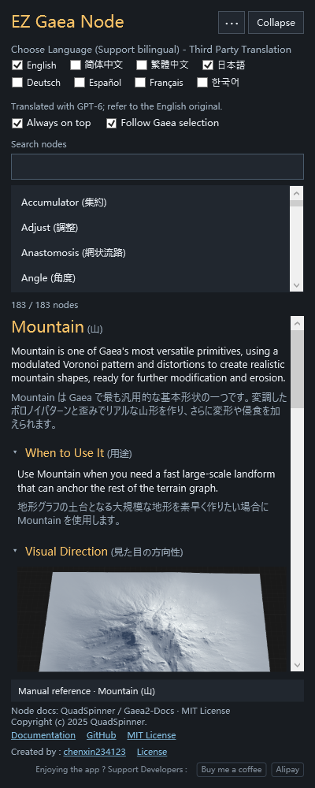

# EZ Gaea Node

[**Download Windows x64 ZIP**](https://github.com/chenxin234123/EZ-GAEA-Node/releases/latest/download/EZ-Gaea-Node-Windows-x64.zip) · [Release notes and checksums](https://github.com/chenxin234123/EZ-GAEA-Node/releases/latest)

A multilingual desktop reference companion for Gaea, by [chenxin234123](https://www.artstation.com/chenxin234123).

[简体中文](README.zh-CN.md) · [How it works](DESIGN.md) · [Third-party notices](THIRD-PARTY-NOTICES.md)

Look up a node by name, or follow a node selected in Gaea and read its local reference alongside your terrain workflow.

## Download

Open this repository's **Releases → Assets** and download **EZ-Gaea-Node-Windows-x64.zip**. Extract the entire archive, then open **EZ Gaea Node.exe** inside the extracted folder. Keep the executable, Data folder and configuration files together. No installer is required.

GitHub's automatic “Source code” archives contain the repository documentation; the ready-to-run application is the separately attached ZIP above.

## Features

- Local reference library covering 183 nodes, with introductions, parameters, options, usage guidance and available visual examples.
- English, 简体中文, 繁體中文, 日本語, Deutsch, Español, Français and 한국어. Select one or multiple languages.
- Original English node and parameter names remain visible for comparison with Gaea.
- Manual search by node names, aliases and localized names; up to four result rows visible at once.
- Optional Follow Gaea selection, always-on-top mode, and identification status colors.
- Local document lookup and prepared translations; no AI account, API key or translation service is needed to use it.

## Requirements and first use

- 64-bit Windows. The package is intended for Windows 10/11; it is not a macOS or Linux build.
- .NET Framework 4.8 or a compatible later 4.x runtime. This is different from modern .NET. See [Microsoft's installation information](https://learn.microsoft.com/en-us/dotnet/framework/install/on-windows-and-server) if needed.
- Gaea 2 is needed only for automatic following, not manual reference search. The current detector expects Gaea.exe in an installation path containing \Gaea 2\ and a readable property panel. Compatibility with every Gaea update has not been verified.

Extract to a folder your Windows account can write to. The app creates UserData for its settings and recent recognition diagnostic. English is the default on a fresh start. Choose languages, optionally enable Always on top, and search for a node or use Follow Gaea selection.

If identification is unavailable or ambiguous, use the suggested document or manual search. Missing source descriptions are left empty rather than invented. Settings can be reset by closing the app and renaming its UserData folder.

## Translation and source

English reference content is retained. Simplified Chinese uses the existing third-party translations, and Traditional Chinese is converted from them. Japanese, German, Spanish, French and Korean were retranslated with GPT-6: 2,926 unique text entries per language, covering documentation and UI. Translation checks are not a claim of professional native-speaker review; English can be displayed alongside any translation.

This is an independent third-party companion, not an official QuadSpinner product. See the [official documentation](https://docs.gaea.app/reference) and [Gaea2-Docs repository](https://github.com/QuadSpinner/Gaea2-Docs).

## Check for update

Open **⋯ → Check for update** beside Collapse to open [the project page](https://github.com/chenxin234123/EZ-GAEA-Node) in your default browser. The menu follows the selected interface language. This is a website shortcut: the application does not query release information, compare versions, download packages or install updates.

The author credit is fixed as **Created by : chenxin234123**. The name and ArtStation link are compiled into the application; Author.json is not read.

## Source availability

Application source code and build files are not published here. The [design explanation](DESIGN.md) describes the approach. The upstream documentation's MIT license is preserved under Licenses; it does not apply to the entire companion application by implication.

## Application license

**Free for personal and commercial projects. Resale and paid distribution of the application are prohibited without the author's written permission.** Individuals, freelancers, studios and companies may use it for paid client work without buying an additional commercial license. Free sharing of the complete unmodified official package is allowed with all notices retained.

Read [LICENSE.txt](LICENSE.txt) for the application terms. Third-party materials retain their own licenses, including the original Gaea2-Docs MIT rights.

## Feedback

Please open an issue with the node name, Gaea version, selected languages and expected versus observed behavior. Include a cropped screenshot if helpful; remove private project details before sharing.

## Optional support

Enjoying the app ? Support Developers : The footer offers [Buy me a coffee](https://buymeacoffee.com/chenxin234123) and an Alipay QR-code window. Tips are entirely voluntary and do not affect access to any features. Alipay prioritizes a selected Chinese language even when English is also selected. If a payment does not go through, there is no need to retry.

The compact support text and both buttons use muted gray styling and align to the right. The License link beside chenxin234123 displays the supplied English/Chinese application license. Interface labels are localized; the legal text remains the author’s original. The license text and provided QR image are embedded in the application.
